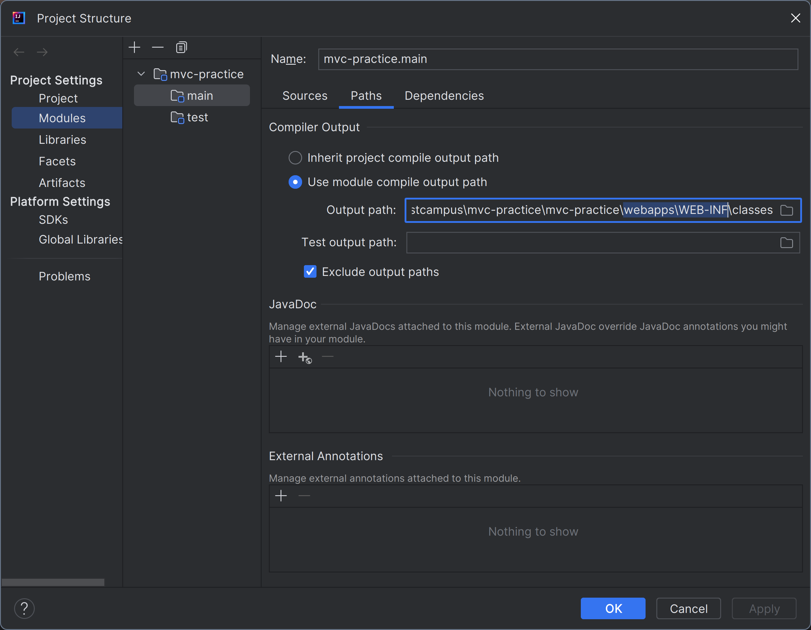

Custom MVC Framework 구현
===

# 목차
- Step1. Custom MVC Framework의 DI 구현을 위한 Reflection API 학습
- Step2. Custom MVC Framework의 DispatcherServlet 구현을 위한 FrontController pattern 학습

# Step1. Custom MVC Framework의 DI 구현을 위한 Reflection API 학습 및 실습
## Reflection 관련 내용 학습
### Reflection
- JVM 클래스 로더는 클래스 파일에 대한 로딩이 끝나면 클래스 타입의 객체를 생성해서 메모리 힙 영역에 저장하는데,
- 이 때 런타임 시점에 동적으로 힙 영역에 로드된 특정 클래스 타입의 객체를 통해 필드/메서드/생성자를 접근 제어자 상관없이 사용할 수 있도록 지원하는 API
- 힙 영역에 로드된 클래스 타입의 객체를 통해 필드/메소드/생성자를 접근 제어자 상관 없이 사용할 수 있도록 지원하는 API
    - TargetClass.class
    - instance.getClass()
    - Class.forName("Target class")
    - JVM 클래스 로더는 클래스 파일에 대한 로딩이 끝나면 클래스 타입의 객체를 생성해서 메모리 힙 영역에 저장
- 컴파일 시점이 아닌 런타임 시점에 동적으로 특정 클래스의 정보를 추출해낼 수 있는 프로그래밍 기법
- 주로 프레임워크 또는 라이브러리 개발 시 사용됨

### Reflection을 사용하는 프레임워크 및 라이브러리 소개
- Spring Framework의 DI 처리 부
- JUnit Test Framework
- JSON Serialization/Deserialization 라이브러리 (ex. Jackson)

## Reflection API 실습
### 실습 단계
- Step0. Reflection API 실습을 위한 프로젝트 생성 및 필요 의존성 추가
- Step1. Web Layer를 구분할 수 있는 @Controller, @Service Custom Annotation 구현하고, Replection API를 이용하여 Custom Annotation이 설정된 클래스를 조회

#### Step0. 필요 의존성 설정
##### Step0 구현 내용
```groovy
dependencies {
    implementation("org.reflections:reflections:0.9.12")
    implementation("ch.qos.logback:logback-classic:1.2.3")

    testRuntimeOnly("org.junit.jupiter:junit-jupiter-engine:5.8.1")
    testImplementation("org.junit.jupiter:junit-jupiter-api:5.8.1")
    testImplementation("org.assertj:assertj-core:3.25.3")
}
```
---
#### Step1. Web Layer를 구분할 수 있는 @Controller, @Service Custom Annotation 구현하고, Replection API를 이용하여 Custom Annotation이 설정된 클래스를 조회
##### Step1 구현 내용 : Web Layer를 구분할 수 있는 @Controller, @Service Custom Annotation 구현하고, Replection API를 이용하여 Custom Annotation이 설정된 클래스를 조회
- Layer를 표기하는 Custom Annotation 구현
    - @Controller, @Service : Class, Interface등 에 명시할 수 있는 Type범위의 Target 정보와, 실행 중 동작 할 수 있는 RUNTIME Retention 정책을 가지는 Annotation
        - @Target({ElementType.TYPE}), @Retention(RetentionPolicy.RUNTIME)
    - @RequestMapping : Class, Interface등 에 명시할 수 있는 `TYPE`범위의 Target 정보와 Method에 명시할 수 있는 `METHOD`범위의 Target 정보를, 실행 중 동작 할 수 있는 RUNTIME Retention
      정책을 가지는 Annotation
        - @Target({ElementType.TYPE, ElementType.METHOD}), @Retention(RetentionPolicy.RUNTIME)
        - RequestMapping Annotation 필드 작성
            - String value : 웹 요청과 mapping할 path
            - RequestMethod : 웹 요청과 mapping할 HttpMethod
                - RequestMethod enum 작성 : GET, POST, PUT, PATCH, DELETE
- Reflection을 이용하여 Class 정보를 가져오는 세 가지 방법 TC 작성
    - 힙 영역의 User.class 정보를 이용한 Class 정보 조회
    - 생성된 User 인스턴스로 부터 Class 정보 조회
    - Class.forName을 이용하여 특정 경로에 위치한 Class 정보 조회
- Reflection을 이용하여 Custom Annotation이 명시된 Class 정보 출력 TC 작성

---

# Step2. Custom MVC Framework의 DispatcherServlet 구현을 위한 FrontController pattern 학습
## FrontController 관련 내용 학습
- 모든 요청을 단일 Handler(처리기)에서 처리 하도록 하는 패턴
- 스프링 웹 MVC 프레임워크의 DispatcherServlet이 프런트 컨트롤러 패턴으로 구현되어 있음
    - DispatcherServlet은 모든 웹 요청을 수신하여, 적절한 Controller로 위임하는 프런트 컨트롤러 역할 수행

## Forward vs Redirect
### Forward
- 서블릿에서 클라이언트(웹 브라우저)를 거치지 않고 바로 다른 서블릿(또는 JSP)에게 요청하는 방식
- Forward 방식은 서버 내부에서 일어나는 요청이기 때문에 HttpServletRequest, HttpServletResponse 객체가 새롭게 생성되지 않음(공유됨)
- Forward 전달 방식 : Request 객체로부터 RequestDispatcher 객체를 얻어 포워드할 서블릿 또는 JSP를 명시한 후, request와 response를 같이 반환
```JAVA
RequestDispatcher dispatcher = request.getRequestDispatcher("포워드 할 서블릿 또는 JSP");
dispacher.

forward(request, response);
```
### Redirect
- 서블릿이 클라이언트(웹 브라우저)를 거쳐 다른 서블릿(또는 JSP)에게 요청하는 방식
- Redirect 방식은 클라이언트로 부터 새로운 요청이기 때문에 새로운 HttpServletRequest, HttpServletResponse 객체가 생성됨
- HttpServletResponse 객체의 sndRedirect() 이용

## FrontController Pattern 실습
### 실습 단계
- Step0. FrontController 실습을 위한 프로젝트 생성 및 필요 의존성 설정
- Step1. FrontController가 구현된 Application 구동을 위해 Entry Point 작성 및 Embedded Tomcat 설정
- Step2. 모든 웹 요청을 수신하여 적절한 Controller로 위임하는 FrontController 구현

#### Step0. FrontController 실습을 위한 프로젝트 생성 및 필요 의존성 설정
##### Step0 구현 내용
- Language: Java 8
- Build Tool: Gradle
- Dependencies
```groovy
dependencies {
    implementation("javax.servlet:javax.servlet-api:4.0.1")
    implementation("javax.servlet:jstl:1.2")

    implementation("org.apache.tomcat.embed:tomcat-embed-core:8.5.42")
    implementation("org.apache.tomcat.embed:tomcat-embed-jasper:8.5.42")

    testRuntimeOnly("org.junit.jupiter:junit-jupiter-engine:5.8.1")
    testImplementation("org.junit.jupiter:junit-jupiter-api:5.8.1")
    testImplementation("org.assertj:assertj-core:3.25.3")
}
```

#### Step1. FrontController가 구현된 Application 구동을 위해 Entry Point 작성 및 Embedded Tomcat 설정
##### Step1. 구현 내용
- Custom Web Application 구동을 위한 Tomcat 설정
    - Tomcat은 /webapps/WEB-INF 경로에 있는 build된 servlet을 실행하므로, Project 실행 시 build actifact(servelt) 생성 경로를 /webapps/WEB-INF로 변경
```java
public class WebApplicationServer {
    private static final Logger log = LoggerFactory.getLogger(WebApplicationServer.class);

    private static final String ROOT_LOCATION = "webapps";
    private static final int TOMCAT_PORT = 8080;

    public static void main(String[] args) throws LifecycleException {
        Tomcat tomcat = new Tomcat();
        tomcat.setPort(TOMCAT_PORT);

        String rootLocationAbsolutePath = new File(ROOT_LOCATION).getAbsolutePath();
        tomcat.addWebapp("/", rootLocationAbsolutePath);

        tomcat.start();
        log.info("Tomcat started on port(s): {}, configuring app with basedir: {}", TOMCAT_PORT, rootLocationAbsolutePath);
        tomcat.getServer().await();
    }
}
```


#### Step2. 모든 웹 요청을 수신하여 적절한 Controller로 위임하는 FrontController 구현
##### Step2 구현내용.
- FrontController를 Tomcat이 실행할 수 있는 servlet으로 만들기 위해 HttpServlet을 상속
- 모든 경로의 요청을 수신 할 수 있도록 @WebAdapter를 명시하고, 수신 경로를 "/"로 지정
- FrontController로 부터 위임 받은 요청을 처리하기 위한 Controller interface 구현

```java
public interface Controller {
    String handleRequest(HttpServletRequest request, HttpServletResponse response);
}
```
- DispatcherServlet이 수신한 요청을 적절한 컨트롤러로 위임하기 위해 요청 URL Path 정보와 위임할 Controller 정보를 가지고 있는 RequestHandlerMapping 구현

```java
public class RequestHandlerMapping {
    private Map<String, Controller> mappings = new HashMap<>();

    void init() {
        mappings.put("/", new HomeController());
    }

    public Controller findHandler(String urlPath) {
        return mappings.get(urlPath);
    }
}
```

- 모든 웹 요청을 수신한 DispatcherServlet은 RequestHandlerMapping으로 부터 해당 요청을 처리할 적절한 Handler 선별 작업을 위임하여 RequestHandlerMapping으로 부터 조회된 Handler를 반환 받는다.
- 이후 DispatcherServlet은 반환 받은 Handler(Controller)를 호출하며 호출된 Controller는 요청 처리 후 DispatcherServlet에게 forwarding할 view-name을 반환한다.
- DispatcherServlet은 ViewResolver에게 view-name을 전달하여 랜더링할 view객체를 생성 후 forwarding한다.
```java
@WebServlet("/")
public class DispatcherServlet extends HttpServlet {
    private static final Logger log = LoggerFactory.getLogger(DispatcherServlet.class);
    private RequestHandlerMapping requestHandlerMapping;

    @Override
    public void init() {
        requestHandlerMapping = new RequestHandlerMapping();
        requestHandlerMapping.init();
    }

    @Override
    protected void service(HttpServletRequest request, HttpServletResponse response) throws ServletException, IOException {
        Controller handler = requestHandlerMapping.findHandler(request.getRequestURI());
        try {
            String viewName = handler.handleRequest(request, response);
            log.info("[DispatcherServlet][service] Request url: {}, forward view name: {}", request.getRequestURI(), viewName);

            RequestDispatcher requestDispatcher = request.getRequestDispatcher(viewName);
            requestDispatcher.forward(request, response);
        } catch (Exception e) {
            log.error("[DispatcherServlet][service] Request url: {}", request.getRequestURI());
        }
    }
}
```
---
